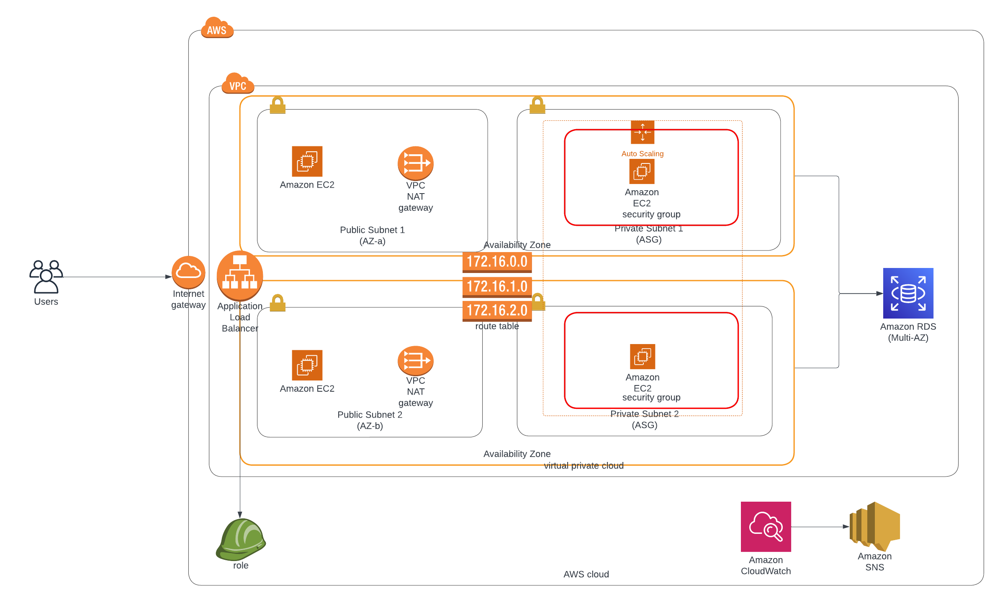

# Scalable Web Application with ALB and Auto Scaling

This project demonstrates how to deploy a **highly available and scalable web application** using **Amazon EC2**, **Application Load Balancer (ALB)**, and **Auto Scaling Groups (ASG)**. Optional components include **Amazon RDS** for database management and **CloudWatch + SNS** for performance monitoring and alerting.

---

## 📊 Solution Architecture Diagram

---

## 🧰 AWS Services Used

- **Amazon EC2**: Hosts the web application.
- **Application Load Balancer (ALB)**: Distributes traffic across healthy EC2 instances.
- **Auto Scaling Group (ASG)**: Automatically adjusts the number of EC2 instances based on demand.
- **Amazon RDS** *(Optional)*: Stores backend data using Multi-AZ MySQL/PostgreSQL.
- **IAM Role**: Secure access to services (e.g., EC2 -> S3, RDS).
- **Amazon CloudWatch**: Monitors system metrics and logs.
- **Amazon SNS**: Sends alert notifications when thresholds are breached.

---

## 📌 Key Features

- ✅ High availability using multiple Availability Zones.
- 📈 Auto scaling based on CPU utilization or custom CloudWatch metrics.
- 🔐 Secure IAM-based access control.
- 🧠 Monitoring and alerting using CloudWatch Alarms and SNS topics.
- 💾 Optional multi-AZ RDS for persistent backend storage.

---

## 📘 Learning Outcomes

By completing this project, you'll learn:

1. How to design and deploy a fault-tolerant EC2-based architecture.
2. How to configure Auto Scaling Groups and Load Balancers.
3. How to monitor EC2/RDS metrics and set up alerting.
4. How to apply security best practices using IAM roles.
5. How to optimize costs and performance on AWS.

---

## 🚀 Deployment Steps (Simplified)

1. Create a VPC with public and private subnets.
2. Launch an **Auto Scaling Group** with EC2 instances in the private subnet.
3. Configure an **Application Load Balancer** in the public subnet.
4. Attach a **Launch Template** to the ASG.
5. (Optional) Set up **Amazon RDS** in private subnet (Multi-AZ enabled).
6. Create **IAM roles** for EC2 access.
7. Enable **CloudWatch monitoring** and set up **SNS** topics for alerts.
