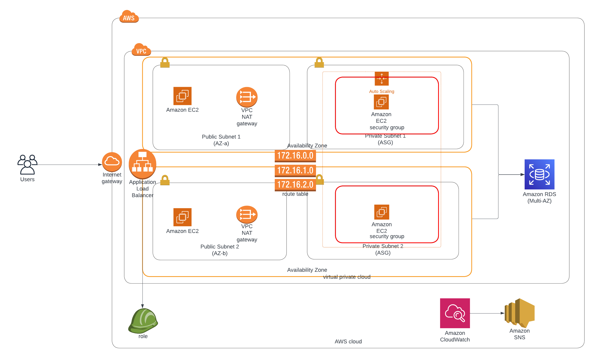

# Scalable Web Application with ALB and Auto Scaling

This project demonstrates how to deploy a **highly available**, **scalable**, and **fault-tolerant web application** on AWS. It leverages core AWS services including **Amazon EC2**, **Application Load Balancer (ALB)**, and **Auto Scaling Groups (ASG)** for compute, as well as optional integration with **Amazon RDS**, **CloudWatch**, and **SNS** for backend storage and operational monitoring.

---

## 📊 Solution Architecture Diagram

> 🧩 The architecture spans **two Availability Zones (AZs)**, using both **public and private subnets**, with critical resources duplicated to ensure **high availability** and **resilience** against single AZ failure.

---

## 🧰 AWS Services Used 

- **Amazon EC2**: Hosts the web application backend.
- **Application Load Balancer (ALB)**: Distributes traffic across healthy EC2 instances in multiple AZs.
- **Auto Scaling Group (ASG)**: Automatically adjusts EC2 capacity based on demand and health checks.
- **Amazon RDS (Multi-AZ)** *(Optional)*: Provides a fault-tolerant backend relational database.
- **IAM Role**: Grants secure access to AWS services (e.g., EC2 to S3, RDS).
- **Amazon CloudWatch**: Collects and monitors logs and metrics from EC2 and ASG.
- **Amazon SNS**: Sends alert notifications when alarms are triggered.

---

## 🔐 High Availability & Redundancy Design

This solution follows the **AWS Well-Architected Framework**, particularly the **Reliability** and **Operational Excellence** pillars. Key HA design decisions include:

- ✅ **Multiple Availability Zones (AZ-a and AZ-b)** for EC2, ALB, and RDS.
- 🛡️ **Auto Scaling Group** spans both private subnets for redundancy and dynamic scaling.
- 🌐 **Application Load Balancer** resides in two public subnets to distribute traffic across AZs and detect failures.
- 🗄️ **Amazon RDS** is configured as a **Multi-AZ deployment**, ensuring automatic failover for database availability.
- 📤 **NAT Gateways** deployed in both AZs enable private EC2 instances to reach the internet for patching or updates.
- 🔔 **Amazon CloudWatch Alarms** detect threshold breaches and trigger **SNS alerts** for incident response.
- 🔑 **IAM roles** restrict and manage access securely between services.

---

## 📌 Key Features

- ✅ Fault-tolerant architecture using **multi-AZ deployment**.
- 📈 On-demand scalability with **Auto Scaling policies**.
- 🔐 Secure architecture using IAM, subnets, and NAT gateways.
- 📊 Real-time metrics, logging, and **automated alerting** via CloudWatch and SNS.
- 💾 Optional **Multi-AZ RDS** ensures backend persistence and failover.

---

## 📘 Learning Outcomes

By completing this project, you will:

1. Architect a secure, HA web application on AWS using best practices.
2. Deploy and configure **Auto Scaling Groups** and **Application Load Balancers**.
3. Monitor infrastructure using **CloudWatch** and integrate **SNS** for alerting.
4. Secure your infrastructure with **IAM roles**, **subnet isolation**, and **routing controls**.
5. Optimize cost and performance through dynamic scaling and modular design.

---

## 🚀 Deployment Steps

1. **Create a VPC** with public and private subnets across two AZs.
2. **Deploy NAT Gateways** in each public subnet for internet access from private instances.
3. Launch an **Auto Scaling Group (ASG)** spanning private subnets in multiple AZs.
4. Attach a **Launch Template** to the ASG to define EC2 settings and scripts.
5. Set up an **Application Load Balancer (ALB)** in both public subnets to distribute incoming traffic.
6. (Optional) Launch an **Amazon RDS (Multi-AZ)** database in private subnets.
7. Create **IAM roles** to securely allow EC2-to-RDS, EC2-to-S3, etc.
8. Enable **Amazon CloudWatch** to collect logs and metrics.
9. Set up **CloudWatch Alarms** and connect them to **Amazon SNS topics** for alerting.
